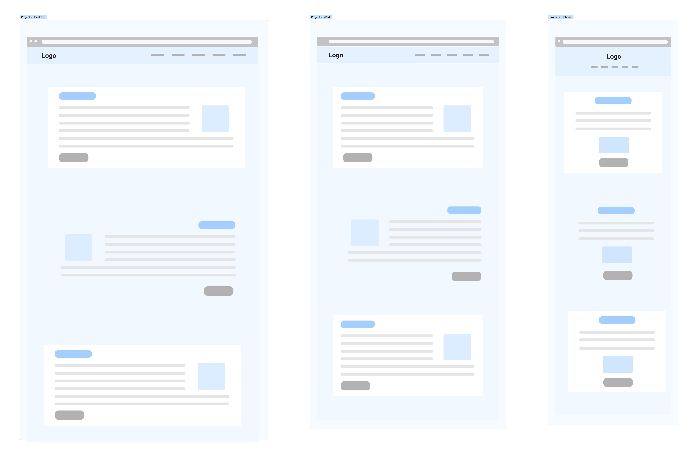

# T1A2 - Portfolio Website

[GitHub Repository](https://github.com/jfhaines/portfolio)
[Netlify Site](https://joehaines-portfolio.netlify.app/)

## Purpose

The goal of this project is to create a website which catches the eye of potential employers and provides an engaging summary of my background, education and prior projects, whilst also providing a demonstration of my skills in frontend web development. 

## Features

This website was built using a minimalistic theme but with bold styling for each of it's sections. In addition to aesthetics, I've attempted to build this site in a way which promotes functionality, displays responsiveness to different screen sizes and embraces accessibility by using semantic HTML.

The pages included are:

- Home: A page featuring a hero unit followed by 'previews' of other pages in the site, with links attached.
- About: A page describing my story, skills, personality and interests.
- Projects: A page featuring my latest web development projects with links to their GitHub repositories.
- Contact: Features an email form with contact details below.
- Blog: Provides a list of blog post previews, each linking to their respective posts
- Blog Articles: 6 different blog articles relating to programming.

## Site Maps

## Wireframes

## Screenshots

## Target Audience

The target audience of this website is for potential employers who are looking for junior devs.

## Tech Stack

- Figma for wireframes
- Adobe Illustrator
- GitHub
- Netlify for deployment
- HTML
- CSS
- SCSS